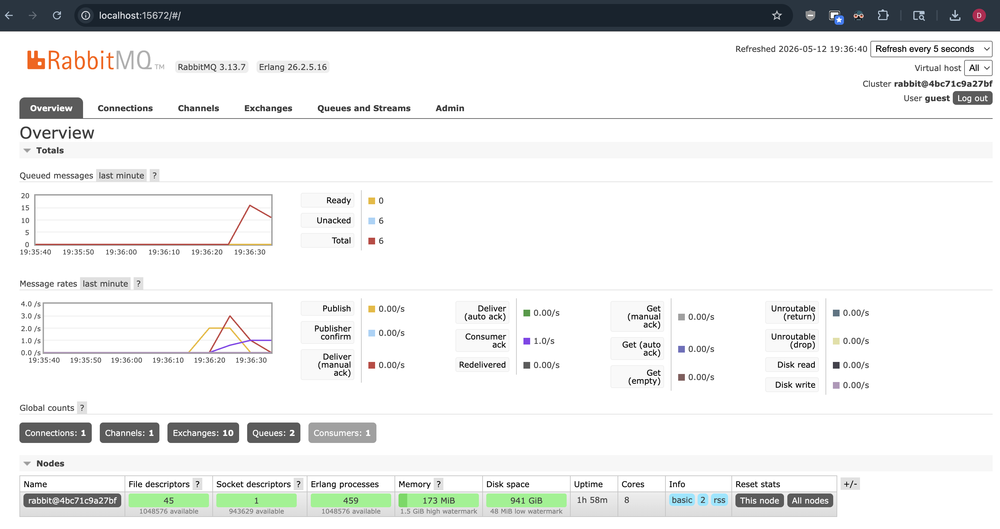
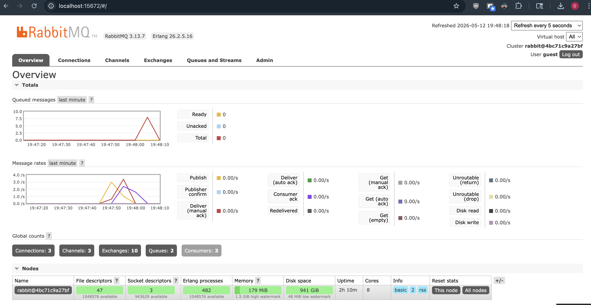

a. What is amqp?

amqp short for Advanced Message Queuing Protocol is a messaging protocol for asynchronous communication between applications through a message broker like RabbitMQ.

b. What does it mean? guest:guest@localhost:5672 , what is the first guest, and what
is the second guest, and what is localhost:5672 is for?

It is the rabbitMQ default connection string on local:
- first guest is the username
- second guest is the password
- localhost:5672 is RabbitMQ's AMQP port

I have 2 queues and its unchanged if I run more subscribers. Presumably its a rabbitMQ preconfigured amount.

The publisher sends all 5 messages rapidly, while the subscriber processes them with a 1 second sleep per message. Messages accumulate in the queue during the processing window, creating the spike.

Possible improvements:
- Publisher: Add delays between publishing messages instead of sending them all at once in a tight loop
- Subscriber: Reduce the conceptual delay from the message handler